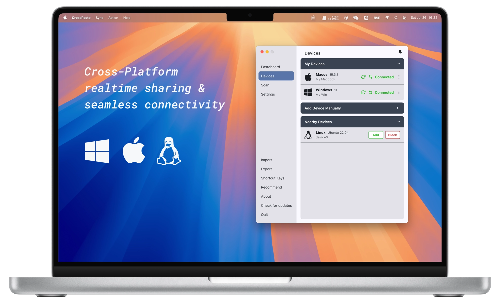

<div align="center">
   
   <h1>CrossPaste: Universal Pasteboard Across Devices</h1>
   <p>
      <b>Copy anything and paste it on any device, seamlessly</b>
      <br />
      <br />
      <a href="https://github.com/CrossPaste/crosspaste-desktop/blob/main/README.zh-CN.md">简体中文</a>
       ·
      <a href="https://crosspaste.com/en/" target="_blank">Official Website</a>
       ·
      <a href="https://deepwiki.com/CrossPaste/crosspaste-desktop" target="_blank">Wiki</a>
       ·
      <a href="https://crosspaste.com/en/download" target="_blank">Download</a>
      <br />
   </p>

   [](https://github.com/CrossPaste/crosspaste-desktop/actions/workflows/ci.yml)
   [](https://github.com/CrossPaste/crosspaste-desktop/actions/workflows/build-release.yml)
   
   [](https://github.com/JetBrains/compose-multiplatform)
   [](https://www.sqlite.org/)
   
   
   [](https://crosspaste.com/en/download)
   [](https://github.com/CrossPaste/crosspaste-desktop/blob/main/LICENSE)
   [](https://deepwiki.com/CrossPaste/crosspaste-desktop)

   <a href="https://github.com/sponsors/CrossPaste"></a>
   
</div>

## ✨ Features

- **🔄 Real-time Sharing**: Instantly share pasteboard content across devices, seamlessly.
- **🖥️ Unified Cross-platform**: Consistent interface on Mac, Windows, and Linux. No need to change habits.
- **📋 Rich Type Support**: Handle various pasteboard types: Text, Color, URL, HTML, RTF, Image, File.
- **🔒 End-to-End Encryption**: Using asymmetric encryption to fully protect your data security.
- **🌐 LAN-only Serverless**: Local storage, serverless architecture. Privacy protection, in your control.
- **🧹 Smart Space Management**: Auto-cleanup options manage pasteboard storage without manual effort.

## 🏗 Getting Started with Development

1. clone the repository

   ```bash
   git clone https://github.com/CrossPaste/crosspaste-desktop.git
   ```

2. Compile and run the application

   ```bash
   cd crosspaste-desktop
   ./gradlew app:run
   ```
   
First start will download [JBR](https://github.com/JetBrains/JetBrainsRuntime) / gradle dependencies.

If you encounter the following error:
```log
FAILURE: Build failed with an exception.

* What went wrong:
java.net.SocketException: Connection reset
> java.net.SocketException: Connection reset
```
you might need a VPN to download these dependencies.

To configure a proxy for gradle, add the following settings to [gradle.properties](./gradle.properties), and adjust the parameters to match your proxy configuration:
```properties
systemProp.https.proxyHost=localhost
systemProp.https.proxyPort=8080
systemProp.https.proxyUser=userid
systemProp.https.proxyPassword=password
systemProp.http.nonProxyHosts=*.nonproxyrepos.com|localhost
```

Additionally, a series of technical [blogs](https://crosspaste.com/en/blog/introduction) about CrossPaste is being published (approximately one article per week). If you're interested in developing cross-platform applications, you're welcome to read them.

## 🗺️ Roadmap
CrossPaste is continuously evolving! We plan to add more useful features in future versions. Here's an overview of our near-term development plans:

- [ ] **v1.3.0**: Support for native pasteboard, improve pasteboard performance
- [ ] **v1.4.0**: Introduction of command-line mode

This is just a small part of our plans. Want to learn more details and long-term plans? Check out our [full roadmap](doc/en/Roadmap.md).

## 🙋 FAQ
Here are some [FAQs](doc/en/FQA.md) that have been collected. If you have other questions, please create an [issue](https://github.com/CrossPaste/crosspaste-desktop/issues/new/choose) to let us know.

## 🤝 Support the project
- **🌟 Star this repository**: This is the easiest way to support CrossPaste and costs nothing.
- **🪲 Report bugs**: Report any bugs you find on the [issue tracker](https://github.com/CrossPaste/crosspaste-desktop/issues/new/choose).
- **📖 Translate**: Help translate and polish CrossPaste into your [language](https://github.com/CrossPaste/crosspaste-desktop/tree/main/app/src/desktopMain/resources/i18n).
- **📝 Contribute**: [Code](doc/en/Contributing.md), comment on issues, and any contributions that can help the project are welcome.
- **💖 Sponsor**: Support financially via [GitHub Sponsors](https://github.com/sponsors/CrossPaste) to help with ongoing development and maintenance.

## 📝 Contributors
<a href="https://github.com/CrossPaste/crosspaste-desktop/graphs/contributors">
   
</a>

## 💖 Sponsors

