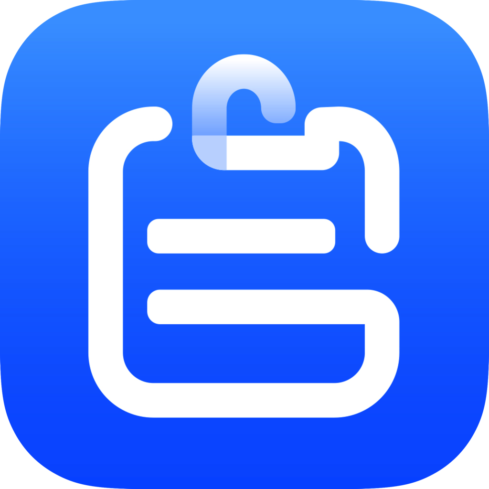

<div align="center">
   
   <h1>Clipevery: 跨设备通用剪贴板</h1>
   <h4>在任何设备上粘贴，一切自然而然。</h4>
</div>

简体中文 / [English](./README.md)

## ✨ 特性

- **🖥️ 多操作系统支持**：在 Mac、Windows 和 Linux 之间无缝操作，实现真正的通用剪贴板。
- **🔄 实时同步**：自动在设备之间实时同步剪贴板，甚至在不同操作系统之间，如 Mac 和 Windows 之间。
- **🔒 端到端加密**：利用 Signal 的端到端加密协议，保持数据安全和私密。
- **📋 丰富的剪贴板类型**：支持各种剪贴板内容，包括文本、URL、富文本、HTML、图像和文件。
- **🧹 自动清理**：提供各种自动清理选项，以有效管理剪贴板空间，无需手动操作。
- **🔌 软件兼容性**：支持主流软件的粘贴板格式，例如 Microsoft Office 、Apple iWork 和 LibreOffice。

## 🏗 开发起步

1. 克隆仓库

   ```bash
   git clone https://github.com/clipevery/clipevery-desktop.git
   ```

2. 编译并启动应用

   ```bash
   cd clipevery-desktop
   ./gradlew clean composeApp:run
   ```

首次启动将下载 [JBR](https://github.com/JetBrains/JetBrainsRuntime) / [chromeDriver](https://googlechromelabs.github.io/chrome-for-testing/) / [chrome-headless-shell](https://googlechromelabs.github.io/chrome-for-testing/) / gradle 依赖.

如果遇到如下错误:
```log
FAILURE: Build failed with an exception.

* What went wrong:
java.net.SocketException: Connection reset
> java.net.SocketException: Connection reset
```
你可能需要 vpn 来下载这些依赖

为 gradle 配置代理，在 [gradle.properties](./gradle.properties) 内添加如下配置，并修改参数为你的代理配置:
```properties
systemProp.https.proxyHost=localhost
systemProp.https.proxyPort=8080
systemProp.https.proxyUser=userid
systemProp.https.proxyPassword=password
systemProp.http.nonProxyHosts=*.nonproxyrepos.com|localhost
```


## 🤝 支持项目

- **🌟 Star 这个项目**：这是支持 Clipevery 最简单的方法。
- **🪲 报告错误**：在[问题追踪器](https://github.com/clipevery/clipevery-desktop/issues/new/choose)上报告你发现的任何错误。
- **📖 翻译**：帮助 Clipevery 翻译、润色到你的[语言](https://github.com/clipevery/clipevery-desktop/tree/main/composeApp/src/desktopMain/resources/i18n)。
- **📝 贡献**：贡献代码、评论 issue，欢迎一切可以帮助到项目的贡献。