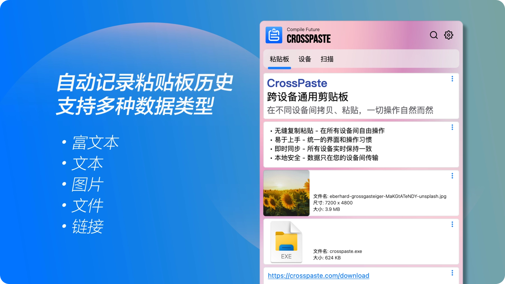

<div align="center">
   
   <h1>CrossPaste: 跨设备的通用粘贴板</h1>
   <h4>在任意设备间复制粘贴，就像在同一台设备上操作一样自然流畅。</h4>
</div>

**简体中文** / [**English**](./README.md)

[](https://github.com/CrossPaste/crosspaste-desktop/actions/workflows/ci.yml)
[](https://github.com/CrossPaste/crosspaste-desktop/actions/workflows/build-release.yml)

[](https://github.com/CrossPaste/crosspaste-desktop/blob/main/LICENSE)

## ✨ 特性

- **🔄 实时共享**：设备之间实时共享粘贴板内容，操作自然流畅。
- **🖥️ 跨平台统一体验**：Mac、Windows 和 Linux 版本界面一致，操作习惯无需改变。
- **📋 丰富的类型支持**：轻松处理多种粘贴数据类型，包括文本、URL、HTML 富文本、图片和文件。
- **🔒 端到端加密保护**：采用 Signal 的端到端加密协议，全方位保障数据安全。
- **🌐 仅局域网无服务器**: 本地存储，无服务器架构。你的数据，唯你所有。隐私保护，由你掌控。
- **🧹 智能空间管理**：提供多样化的自动清理选项，高效管理粘贴板存储空间，无需手动干预。

## 🏗 开发起步

1. 克隆仓库

   ```bash
   git clone https://github.com/CrossPaste/crosspaste-desktop.git
   ```

2. 编译并启动应用

   ```bash
   cd crosspaste-desktop
   ./gradlew clean composeApp:run
   ```

首次启动将下载 [JBR](https://github.com/JetBrains/JetBrainsRuntime) / [chromeDriver](https://googlechromelabs.github.io/chrome-for-testing/) / [chrome-headless-shell](https://googlechromelabs.github.io/chrome-for-testing/) / gradle 依赖.

如果遇到如下错误:
```log
FAILURE: Build failed with an exception.

* What went wrong:
java.net.SocketException: Connection reset
> java.net.SocketException: Connection reset
```
你可能需要 vpn 来下载这些依赖

为 gradle 配置代理，在 [gradle.properties](./gradle.properties) 内添加如下配置，并修改参数为你的代理配置:
```properties
systemProp.https.proxyHost=localhost
systemProp.https.proxyPort=8080
systemProp.https.proxyUser=userid
systemProp.https.proxyPassword=password
systemProp.http.nonProxyHosts=*.nonproxyrepos.com|localhost
```


## 🤝 支持项目

- **🌟 Star 这个项目**：这是支持 CrossPaste 最简单的方法。
- **🪲 报告错误**：在[问题追踪器](https://github.com/CrossPaste/crosspaste-desktop/issues/new/choose)上报告你发现的任何错误。
- **📖 翻译**：帮助 CrossPaste 翻译、润色到你的[语言](https://github.com/CrossPaste/crosspaste-desktop/tree/main/composeApp/src/desktopMain/resources/i18n)。
- **📝 贡献**：[贡献代码](./Contributing.zh-CN.md)、评论 issue，欢迎一切可以帮助到项目的贡献。
- **💖 赞助支持**: 通过 [GitHub Sponsors](https://github.com/sponsors/CrossPaste) 在经济上支持项目，以帮助持续开发和维护。