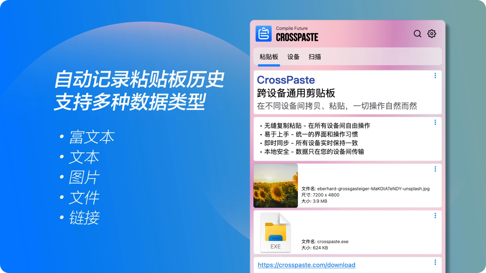

<div align="center">
   
   <h1>CrossPaste: 跨设备的通用粘贴板</h1>
   <p>
      <b>在任意设备间复制粘贴，就像在同一台设备上操作一样自然流畅</b>
      <br />
      <br />
      <a href="https://github.com/CrossPaste/crosspaste-desktop/blob/main/README.md">English</a>
       ·
      <a href="https://crosspaste.com/en/" target="_blank">Official Website</a>
       ·
      <a href="https://deepwiki.com/CrossPaste/crosspaste-desktop" target="_blank">Wiki</a>
       ·
      <a href="https://crosspaste.com/download" target="_blank">Download</a>
      <br />
   </p>

   [](https://github.com/CrossPaste/crosspaste-desktop/actions/workflows/ci.yml)
   [](https://github.com/CrossPaste/crosspaste-desktop/actions/workflows/build-release.yml)
   
   [](https://github.com/JetBrains/compose-multiplatform)
   [](https://www.sqlite.org/)
   
   
   [](https://crosspaste.com/download)
   [](https://github.com/CrossPaste/crosspaste-desktop/blob/main/LICENSE)
   [](https://deepwiki.com/CrossPaste/crosspaste-desktop)

   <a href="https://github.com/sponsors/CrossPaste"></a>
   
</div>

## ✨ 特性

- **🔄 实时共享**：设备之间实时共享粘贴板内容，操作自然流畅。
- **🖥️ 跨平台统一体验**：Mac、Windows 和 Linux 版本界面一致，操作习惯无需改变。
- **📋 丰富的类型支持**：轻松处理多种粘贴数据类型，包括文本、颜色、URL、HTML 富文本、图片和文件。
- **🔒 端到端加密保护**：采用非对称加密算法，全方位保障数据安全。
- **🌐 仅局域网无服务器**: 本地存储，无服务器架构。你的数据，唯你所有。隐私保护，由你掌控。
- **🧹 智能空间管理**：提供多样化的自动清理选项，高效管理粘贴板存储空间，无需手动干预。
- **🔍 内置 OCR**：本地从图片中提取文字，全程离线，截图永远不会离开你的设备。
- **🤖 MCP 服务**：通过 Model Context Protocol 把粘贴板历史暴露给 AI 助手（如 Claude 等）使用。
- **🌍 Chrome 扩展**：让粘贴板与浏览器互通——在一台设备的网页里复制，在任意其他设备粘贴。

## 🏗 开发起步

1. 克隆仓库

   ```bash
   git clone https://github.com/CrossPaste/crosspaste-desktop.git
   ```

2. 编译并启动应用

   ```bash
   cd crosspaste-desktop
   ./gradlew clean app:run
   ```

首次启动将下载 [JBR](https://github.com/JetBrains/JetBrainsRuntime) / gradle 依赖.

如果遇到如下错误:
```log
FAILURE: Build failed with an exception.

* What went wrong:
java.net.SocketException: Connection reset
> java.net.SocketException: Connection reset
```
你可能需要 vpn 来下载这些依赖

为 gradle 配置代理，在 [gradle.properties](./gradle.properties) 内添加如下配置，并修改参数为你的代理配置:
```properties
systemProp.https.proxyHost=localhost
systemProp.https.proxyPort=8080
systemProp.https.proxyUser=userid
systemProp.https.proxyPassword=password
systemProp.http.nonProxyHosts=*.nonproxyrepos.com|localhost
```

另外关于 CrossPaste 的[技术博客](https://crosspaste.com/blog/introduction)也正在连载（大概每周一篇），如果你对开发跨平台应用感兴趣，欢迎阅读。

### 🌍 本地构建 Chrome 扩展

Chrome 扩展位于 [`web/`](./web) 目录下，通过 Gradle 构建。需要本机安装 Node.js（>= 18），首次构建时 `npmInstall` 任务会自动拉取依赖。

1. 构建扩展

   ```bash
   ./gradlew :web:build
   ```

   构建产物（未打包的扩展）输出到 `web/dist/`。

2. 加载到 Chrome

   - 打开 `chrome://extensions/`
   - 在右上角开启 **开发者模式**
   - 点击 **加载已解压的扩展程序**，选择 `web/dist/` 目录

扩展会自动发现同一台机器上运行的 CrossPaste 桌面端，并与之同步粘贴板内容。如果想快速迭代扩展代码，可以在 `web/` 目录下执行 `npm run dev` 进入 Vite 开发模式，然后在 Chrome 中点击重新加载扩展即可。扩展依赖由 `./gradlew :core:jsBrowserProductionLibraryDistribution` 生成的 Kotlin/JS `core` 库（`:web:build` 任务也会自动构建一次），修改 `core/` 源码后需要重跑这个任务，`npm run dev` 才能拿到最新产物。

## 🗺️ 路线图
CrossPaste 正在持续发展中！**v2.0** 把 Chrome 扩展作为一等公民接入了同步网络。接下来我们正在筹备：

- [ ] **命令行模式**：让 CrossPaste 可以在终端和 Shell 脚本中被驱动
- [ ] **插件系统**：让社区可以为 CrossPaste 扩展自定义粘贴类型与集成能力

这只是我们计划的一小部分。想了解更多细节和长期规划？查看我们的[完整路线图](doc/zh/Roadmap.md)。

## 🙋 常见问题
这是当前收集的一些[常见问题](doc/zh/FQA.md)，如果你有其他问题，请创建 [issue](https://github.com/CrossPaste/crosspaste-desktop/issues/new/choose) 让我们知道。

## 🤝 支持项目
- **🌟 Star 这个项目**：这是支持 CrossPaste 最简单的方法。
- **🪲 报告错误**：在[问题追踪器](https://github.com/CrossPaste/crosspaste-desktop/issues/new/choose)上报告你发现的任何错误。
- **📖 翻译**：帮助 CrossPaste 翻译、润色到你的[语言](https://github.com/CrossPaste/crosspaste-desktop/tree/main/app/src/desktopMain/resources/i18n)。
- **📝 贡献**：[贡献代码](doc/zh/Contributing.md)、评论 issue，欢迎一切可以帮助到项目的贡献。
- **💖 赞助支持**: 通过 [GitHub Sponsors](https://github.com/sponsors/CrossPaste) 在经济上支持项目，以帮助持续开发和维护。

## 📝 贡献者
<a href="https://github.com/CrossPaste/crosspaste-desktop/graphs/contributors">
   
</a>

## 💖 赞助
