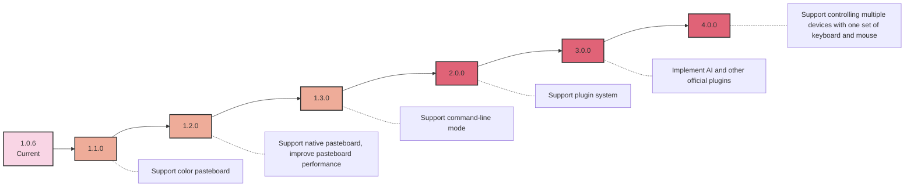

# Project Roadmap

Below is our current project roadmap, outlining the planned features and versions from the current release to future major updates:

**Note**: This roadmap represents our current development plans and vision for the project. As development progresses, adjustments may be made based on community feedback, technological advancements, and changing priorities. We welcome community involvement and contributions! If you're interested in helping shape the future of this project, please consider joining our community and contributing to its growth.

Your input and contributions can make a significant impact on the project's development. Whether it's through code contributions, feature suggestions, or helping with documentation, there are many ways to get involved. Check out our [Contributing Guidelines](./Contributing.md) to learn more about how you can participate.

Together, we can build something amazing!