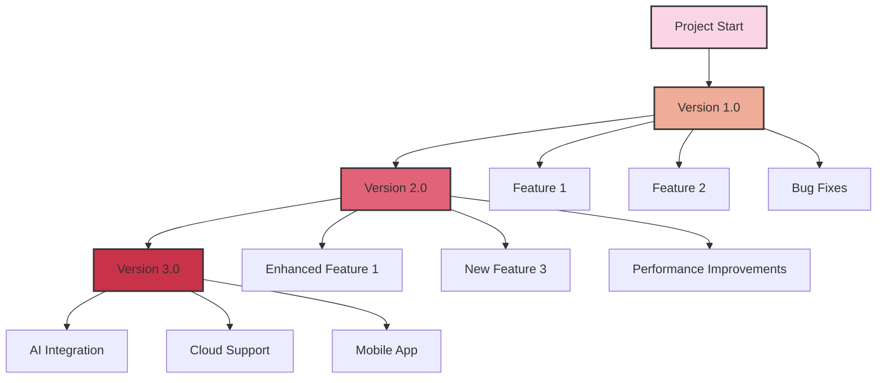

```mermaid
graph TD
A[Project Start] --> B[Version 1.0]
B --> C[Version 2.0]
C --> D[Version 3.0]

B --> B1[Feature 1]
B --> B2[Feature 2]
B --> B3[Bug Fixes]

C --> C1[Enhanced Feature 1]
C --> C2[New Feature 3]
C --> C3[Performance Improvements]

D --> D1[AI Integration]
D --> D2[Cloud Support]
D --> D3[Mobile App]

style A fill:#f9d5e5,stroke:#333,stroke-width:2px
style B fill:#eeac99,stroke:#333,stroke-width:2px
style C fill:#e06377,stroke:#333,stroke-width:2px
style D fill:#c83349,stroke:#333,stroke-width:2px
```