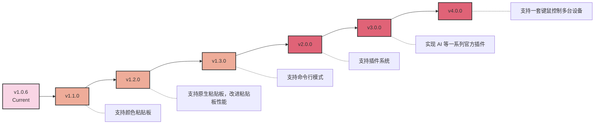

# 项目路线图

以下是我们当前的项目路线图，概述了从当前版本到未来主要更新的计划功能和版本：

**注意**： 此路线图代表了我们当前的开发计划和项目愿景。随着开发的进行，我们可能会根据社区反馈、技术进步和不断变化的优先级进行调整。我们欢迎社区参与和贡献！如果您对帮助塑造这个项目的未来感兴趣，请考虑加入我们的社区，为项目的成长贡献力量。

您的意见和贡献可以对项目的发展产生重大影响。无论是通过代码贡献、功能建议，还是帮助完善文档，都有多种方式可以参与其中。查看我们的[贡献指南](./Contributing.zh-CN.md)，了解更多关于如何参与的信息。

让我们一起努力，让这个项目变的更棒！
