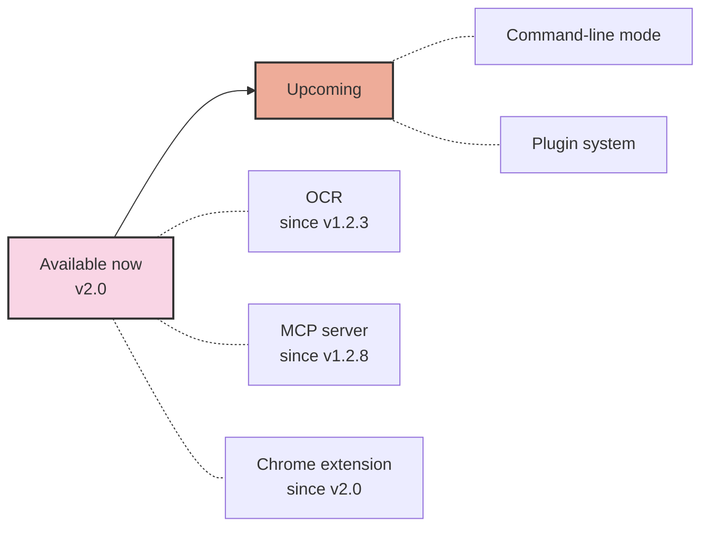

# Project Roadmap

Below is our current project roadmap. Rather than pinning features to specific version numbers, we group them into what has shipped and what we're working on next:

## Available now

- **OCR** _(since v1.2.3)_ — extract text from images locally, with no network calls.
- **MCP server** _(since v1.2.8)_ — expose pasteboard history to AI assistants via the Model Context Protocol.
- **Chrome extension** _(since v2.0)_ — sync clipboard between the browser and any paired CrossPaste device.

## Upcoming

- **Command-line mode** — drive CrossPaste from your terminal and shell scripts.
- **Plugin system** — let the community extend CrossPaste with custom paste types and integrations.

**Note**: This roadmap represents our current development plans and vision for the project. As development progresses, adjustments may be made based on community feedback, technological advancements, and changing priorities. We welcome community involvement and contributions! If you're interested in helping shape the future of this project, please consider joining our community and contributing to its growth.

Your input and contributions can make a significant impact on the project's development. Whether it's through code contributions, feature suggestions, or helping with documentation, there are many ways to get involved. Check out our [Contributing Guidelines](Contributing.md) to learn more about how you can participate.

Together, we can build something amazing!
