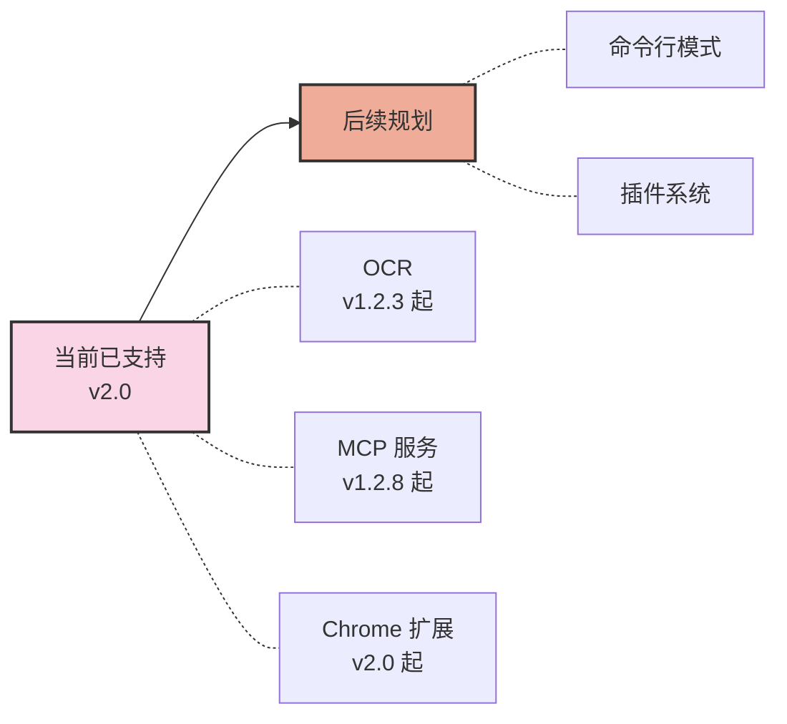

# 项目路线图

以下是我们当前的项目路线图。我们不再把每个功能强行绑定到具体的版本号上，而是按"已发布"与"接下来要做"两类来组织：

## 当前已支持

- **OCR**（自 v1.2.3 起）：本地从图片中提取文字，全程离线，不产生任何网络请求。
- **MCP 服务**（自 v1.2.8 起）：通过 Model Context Protocol 把粘贴板历史暴露给 AI 助手使用。
- **Chrome 扩展**（自 v2.0 起）：让浏览器与已配对的 CrossPaste 设备之间同步粘贴板内容。

## 后续规划

- **命令行模式**：让 CrossPaste 可以在终端和 Shell 脚本中被驱动。
- **插件系统**：让社区可以为 CrossPaste 扩展自定义粘贴类型与集成能力。

**注意**：此路线图代表了我们当前的开发计划和项目愿景。随着开发的进行，我们可能会根据社区反馈、技术进步和不断变化的优先级进行调整。我们欢迎社区参与和贡献！如果您对帮助塑造这个项目的未来感兴趣，请考虑加入我们的社区，为项目的成长贡献力量。

您的意见和贡献可以对项目的发展产生重大影响。无论是通过代码贡献、功能建议，还是帮助完善文档，都有多种方式可以参与其中。查看我们的[贡献指南](Contributing.md)，了解更多关于如何参与的信息。

让我们一起努力，让这个项目变的更棒！
